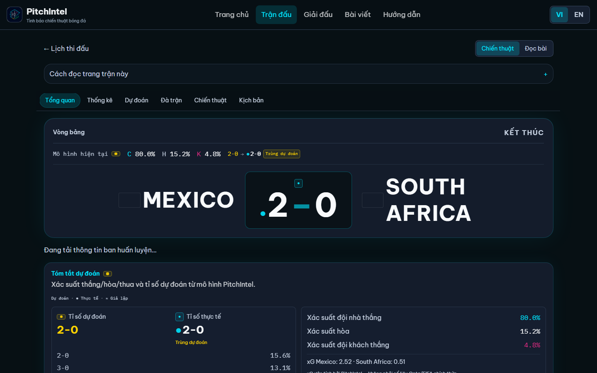
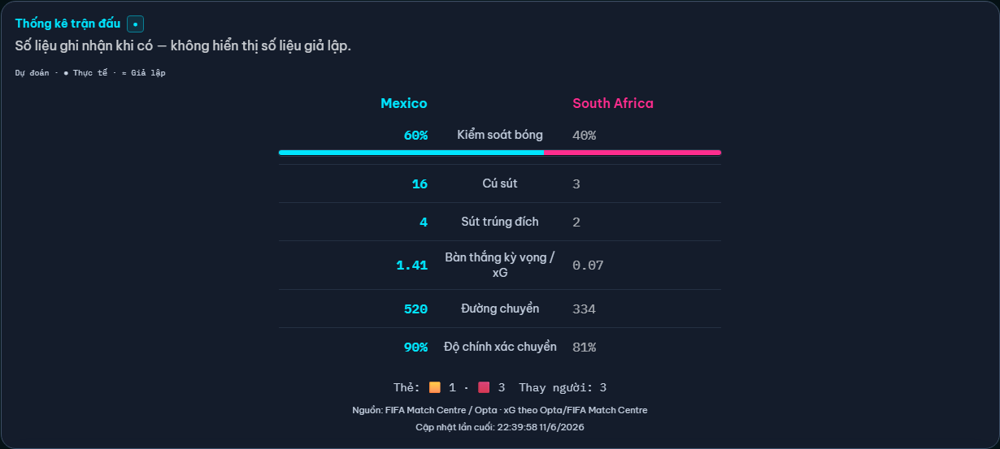
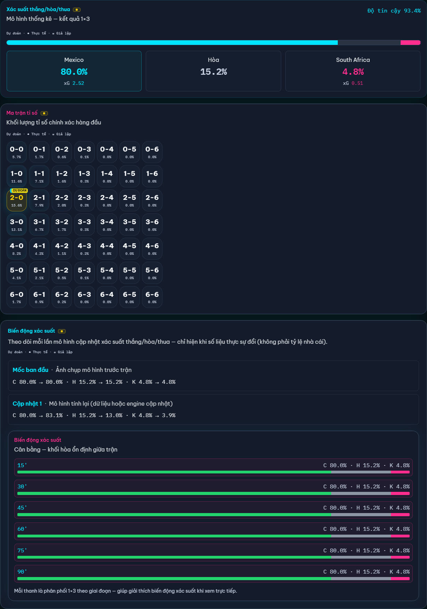
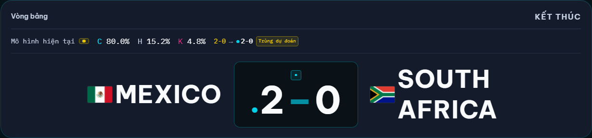

# World Cup Intelligence (PitchIntel)

**PitchIntel** — nền tảng phân tích chiến thuật & xác suất cho **FIFA World Cup 2026**, chạy trên Cloudflare Workers.

🌐 **Production:** [wcstat.orangecloud.vn](https://wcstat.orangecloud.vn) · **UAT:** [wc-tactical-uat.sycu-lee.workers.dev](https://wc-tactical-uat.sycu-lee.workers.dev)

---

## Cập nhật mới (06/2026)

Phiên bản production ([wcstat.orangecloud.vn](https://wcstat.orangecloud.vn)) — xác minh qua Cloudflare Dashboard hoặc `GET /api/health` (`lastFifaSync`, `lastDataRefresh`).

### Minh chứng trên web (Mexico 2–0 South Africa)

| | |
|---|---|
| **Trang trận — tỉ số FT, recap, dự đoán** |  |
| **Thống kê trận đấu** — layout cân đối, bar kiểm soát bóng, nguồn FIFA/Opta |  |
| **Xác suất thắng/hòa/thua** — không còn dấu `~` trước số dự đoán |  |
| **Sơ đồ sân** — đội hình thực tế, điểm cầu thủ, vector di chuyển |  |

Demo live: [Mexico vs South Africa](https://wcstat.orangecloud.vn/matches/vong-bang-a-mexico-vs-south-africa)

| Hạng mục | Thay đổi |
|----------|----------|
| **FIFA lịch & kết quả** | Kickoff UTC + `fifa_match_id` cho 104 trận từ FIFA Match Centre (`0031`); backfill kết quả FT (`0032`). |
| **FIFA live sync** | Cron mỗi phút: tỉ số, sự kiện, possession, lineup pre-kickoff; blog/stats qua `fifaLiveBlogSync`. |
| **Public API v1** | `GET /api/v1/feed`, snapshot, SSE stream, webhooks — `X-API-Key` bắt buộc trên production. |
| **Capability scenarios** | 22 scenario pass/fail — `npm run test:scenarios`; streak 10 liên tiếp: `npm run test:scenarios:streak` → [docs/CAPABILITY_SCENARIOS.md](./docs/CAPABILITY_SCENARIOS.md). |
| **Xác suất trận FT** | Trận `completed`: API trả snapshot **pre-match** (minute 0), không leak tỉ số live vào W/D/L (`getDisplaySnapshot`). |
| **CI deploy** | GitHub Actions chạy D1 migrations **trước** deploy (UAT + production). |
| **Trang chủ — hướng dẫn** | Quick-start 4 bước: khối thu gọn + **4 tab full-width** (mobile: 1–4) + panel một bước/lần. |
| **Trang chủ — tải nhanh** | KV + Workers cache cho `/api/home`; progressive load schedule/standings. |
| **Độ chính xác dự đoán** | Panel homepage: favorite hit rate, top-3 scoreline, Brier, avg actual-score prob (`wc-prob-v5`). |
| **Mô hình wc-prob-v5** | Attack/defense split, H2H modifier, calibration grid; bulk recompute 104 trận. |
| **Tin tức đa nguồn** | **24 RSS** + **VnExpress WC2026** (HTML blog) + FIFA WC2026; crawl 15 phút. |
| **Vua phá lưới (homepage)** | Leaderboard ghi bàn cầu thủ từ `match_events` — hiển thị trên trang chủ. |
| **QA local** | `docs/QA_INVENTORY.md`, `npm run bootstrap:local-qa`, `npm run test:qa-local` (14 checks). |
| **Nav Giải đấu** | Menu *Tournaments* → `/matches?tab=standings` (deep-link tab URL). |
| **Xác suất live 15p** | Cron + `liveMatchStatsModifier` cập nhật xác suất từ thống kê trận đang diễn ra. |
| **Mobile UX** | `GroupStageBoard` stack 2 dòng; padding panel nhỏ hơn trên mobile. |
| **Ma trận tỉ số** | Chỉ hiển thị ô có xác suất ≥ 0,1% (giữ highlight + tỉ số thực tế). |
| **Vô địch (MC v3)** | H2H, phong độ hiệp, blend strength 35/65; Poisson tight scores cho top đội. |
| **Trang trận** | Sửa crash thiếu import `MatchAnalyticsPanel`; trang hiển thị đầy đủ sau khi API trả dữ liệu. |
| **Thống kê trận (`MatchLiveStatsPanel`)** | Layout mobile-first: nhãn chỉ số ở giữa, số hai đội hai cột; bar possession full-width; tên đội rút gọn trên mobile. |
| **Nhãn dự đoán** | Bỏ dấu `~` trên xác suất/xG/tỉ số dự đoán; giữ `●` (thực tế) và `≈` (giả lập). Component `DataKindBadge` / `DataKindMark`. |
| **Pitch map** | `GET /api/matches/:ref/pitch-map` — sơ đồ sân, lineup live, rating, movement vectors (`PitchMap`, migration `0028`). |
| **Recap & staff** | Tóm tắt trận FIFA (`MatchRecapPanel`), HLV/trọng tài (`MatchStaffPanel`, migration `0025`). |
| **News → trận** | Pipeline FIFA WC2026 + RSS mở rộng; dịch VI, publish, ảnh hưởng dự đoán khi tin liên quan trận (`newsMatchImpact`, migration `0029`). |
| **FIFA live sync** | Lineup/stats/events từ FIFA Match Centre; Mexico–SA seed + lịch sử WC (`0023`–`0027`). |
| **Deploy an toàn** | `npm run deploy:both` (migrate UAT → deploy UAT → migrate prod → deploy prod); token qua `cf-deploy.token` + GitHub Actions. |
| **Bảng đấu — xác suất trận** | Trận đã phân tích hiện **C · H · K** (% mô hình); trận chưa có hiện **«Chưa có»**. API gap-fill (xem [Thuật toán gap-fill](#gap-fill-xác-suất-bảng-đấu)). |
| **Mobile UX trang trận** | Thanh tỉ số dính, điều hướng section (`MatchSectionNav`), panel dự đoán/tóm tắt/analytics. |
| **SEO tiếng Việt** | 8 landing page + `sitemap.xml`. |
| **Tài liệu API** | `/docs/api` (HTML) · `/docs/api.md` · `/.well-known/openapi.json` — Core / Tournament / Teams & news / Admin. |
| **UAT tách biệt** | `npm run deploy:uat` / `deploy:production` / `deploy:both` — [docs/UAT.md](./docs/UAT.md). |

Tài liệu API: [/docs/api](https://wcstat.orangecloud.vn/docs/api) · [OpenAPI](https://wcstat.orangecloud.vn/.well-known/openapi.json)

Chụp lại screenshot sau deploy: `node scripts/capture-screenshots.mjs`.  
Demo trận đã có dữ liệu FIFA: [Mexico vs South Africa](https://wcstat.orangecloud.vn/matches/vong-bang-a-mexico-vs-south-africa).

---

## Tính năng chính

### Trang chủ (`/`)
- **Hướng dẫn người mới** — khối thu gọn *Lần đầu vào? Bắt đầu trong 4 bước* (`NewUserQuickStart`); mở rộng hiện **4 tab full-width** (mobile: số 1–4; desktop: nhãn ngắn) + một panel nội dung; link *Hướng dẫn đầy đủ* → `/guide`
- Trận nổi bật (featured match) + xác suất real-time
- **Bảng đấu** (`GroupStageBoard`) — hai tab chính, lazy-load để tránh quá tải:
  - **Bảng đấu vòng bảng** — 12 bảng A–L, xếp hạng đội thứ 3, xác suất trận vòng bảng
  - **Vòng loại trực tiếp** — tab con theo vòng: *Vòng 1/16*, *Vòng 1/8*, *Tứ kết*, *Bán kết*, *Tranh hạng 3*, *Chung kết* (mỗi lần chỉ hiển thị một vòng)
- **Xác suất trên lịch bảng:** `38 · 26 · 35` = đã có phân tích mô hình (**C**hủ · **H**òa · **K**hách); **«Chưa có»** = engine chưa snapshot — tự cập nhật qua API gap-fill (poll 30s)
- Lịch thi đấu rút gọn, tin nóng, snapshot giải (scheduled / live / completed)
- Song ngữ **Tiếng Việt / English** — chuyển một lần trên header; toàn site (nav, lịch, bảng, nhánh, trận, tin, hướng dẫn) hiển thị khác nhau theo locale
- Nhãn vòng đấu VI: *Bảng A*, *Vòng 1/16*, *Chung kết*; đối đầu: *Đội A gặp Đội B* (`app/lib/i18n/stageLabels.ts`)
- **Cờ quốc gia** — PNG qua `flagcdn.com` (hiển thị đúng trên Windows, không phụ thuộc emoji)
- **Giờ thi đấu** — múi giờ trình duyệt + tham chiếu giờ Việt Nam (`MatchKickoffDisplay`)
- Tin nóng tự dịch VI; làm mới mỗi 30 giây
- **Vua phá lưới** (`TopScorersPanel`) — top cầu thủ ghi bàn từ trận FT, cập nhật qua `/api/home`

### Trung tâm trận đấu (`/matches`)
- Hub 4 tab: **Lịch thi đấu** · **Bảng xếp hạng** · **Yêu thích** · **Đội** — deep-link `?tab=standings|favorites|teams`
- Menu header *Giải đấu* trỏ thẳng tab **Bảng xếp hạng** (`/matches?tab=standings`)
- Lịch đầy đủ **104 trận** WC 2026 — kickoff UTC từ **FIFA Match Centre** (`scripts/wc2026-fifa-kickoffs.json`, migration `0031`)
- Tỉ số **LIVE** và **FT** trên lịch, làm mới mỗi 30 giây
- Lọc lịch: tất cả / vòng bảng / knockout; xuất **.ics** (Google Calendar / Apple Calendar)
- **Yêu thích** — lưu trận/đội trên localStorage, panel riêng
- Tab **Bảng xếp hạng** dùng cùng `GroupStageBoard` như trang chủ
- Link trận dùng **slug tiếng Việt** (xem mục URL trận bên dưới)

### URL trận (slug SEO-friendly)

Mỗi trận có URL dạng **`vòng-đội-a-vs-đội-b`** (ASCII, không dấu):

| Vòng | Slug vòng | Ví dụ |
|------|-----------|--------|
| Bảng A | `vong-bang-a` | `/matches/vong-bang-a-united-states-vs-mexico` |
| Vòng 1/16 | `vong-1-16` | `/matches/vong-1-16-argentina-vs-france` |
| Vòng 1/8 | `vong-1-8` | … |
| Tứ kết | `vong-tu-ket` | … |
| Bán kết | `vong-ban-ket` | … |
| Tranh hạng 3 | `tranh-hang-3` | … |
| Chung kết | `chung-ket` | `/matches/chung-ket-argentina-vs-france` |

- Phân tích dài: `/matches/{slug}/analysis`
- Đội hình: `/lineups/{slug}`
- API & sitemap dùng cùng slug; response có field `slug`
- URL cũ `m-w26-ga-1v2` vẫn hoạt động → **redirect client-side** sang slug canonical
- Logic: `src/utils/matchSlug.ts`, `src/services/matchRef.ts`

### Pipeline sau trận (backend)
Cron mỗi phút (`refresh_minute`), khi `FIFA_LIVE_ENABLED=true` (production):
1. **FIFA Match Centre** — `syncFifaWc2026Matches`: kickoff, tỉ số live/FT, `fifa_match_id`, events, possession
2. **Lineup pre-kickoff** — `syncFifaLineupsForUpcomingMatches` (từ 10 phút trước giờ đá)
3. Trận kết thúc → **tiến vòng knockout** + **xếp hạng bảng** + bulk recompute (KV flag / queue)

Fallback khi tắt FIFA live (`MOCK_SOURCES=true`): mock ticks qua `MatchDataProvider` trong `matchDataRefresh.ts`.

### Chi tiết trận (`/matches/:slug`)
- **Mobile-first:** thanh tỉ số dính khi cuộn, tab section (Tổng quan / Thống kê / Dự đoán / Đà trận / Chiến thuật / Kịch bản)
- **Xác suất real-time** — poll 30s (15s khi LIVE): tỉ lệ thắng/hòa/thua, xG, độ tin cậy, tỉ số khả dĩ nhất, driver
- Panel xác suất hiển thị **tên đội** (không còn Chủ nhà/Khách), badge LIVE khi trận đang diễn ra
- **Đội hình** — chỉ hiển thị khi có XI **chính thức** (`is_official = 1`, ≥ 7 cầu thủ); format `(số) - tên - vị trí`; nếu chưa có → *"Chưa có thông tin chính xác, sẽ cập nhật sau"*
- Trang riêng `/lineups/:slug`
- **Cơ cấu đóng góp đội** — section riêng full-width, nhãn đầy đủ (Ép sân, Kiến tạo, …), đặt trên lịch sử đối đầu
- **Đối đầu World Cup** — các trận giữa hai đội ở các kỳ WC trước 2026, kèm tỉ số & vòng đấu
- Team system, **dự đoán đa kịch bản** (Scenario Predictions), kịch bản sự kiện (legacy scenarios), mô hình vs thị trường
- Preview AI, tactical briefing, biến động xác suất theo thời gian
- **Thống kê trận** — `MatchLiveStatsPanel` (poll `/api/matches/:ref/stats` khi có dữ liệu)
- **Tóm tắt dự đoán** — `MatchPredictionSummary` (W/D/L, xG, top scorelines từ snapshot)

### Trang SEO tiếng Việt (`app/lib/seoPages.ts`)

8 landing page VI-first, link vào hub sản phẩm hiện có (không duplicate logic):

| Path | Nội dung |
|------|----------|
| `/lich-thi-dau-world-cup-2026` | Lịch 104 trận |
| `/ti-so-truc-tiep-world-cup-2026` | Tỉ số trực tiếp |
| `/bang-xep-hang-world-cup-2026` | Bảng xếp hạng |
| `/ket-qua-world-cup-2026` | Kết quả |
| `/du-doan-world-cup-2026` | Dự đoán |
| `/lich-su-doi-dau-world-cup` | Lịch sử đối đầu |
| `/tin-tuc-world-cup-2026` | Tin tức |
| `/huong-dan-doc-xac-suat` | Hướng dẫn đọc xác suất |

Tất cả có trong `/sitemap.xml` (`src/services/siteDiscovery.ts`).

### Đội hình chính thức → trận đấu (backend)
Cron mỗi phút (`refresh_minute`) và admin API:
1. Đọc **squad chính thức** (`squads.is_official = 1`, ≥ 7 cầu thủ)
2. Ghi `lineups` + `lineup_players` cho các trận WC 2026 sắp diễn ra (14 ngày tới)
3. Không ghi đè XI **match-day** đã xác nhận (`source_type = match_official`)
4. **Recompute** xác suất cho các trận bị ảnh hưởng; engine dùng `homeLineup` / `awayLineup`

> Squad seed hiện chỉ có vài cầu thủ/đội — cần mở rộng squad hoặc nhập XI qua admin để thấy badge **Chính thức** trên web.

### Dự đoán đa kịch bản (Multi-Scenario Prediction Engine)

Mỗi trận có **≥ 2 kịch bản phân tích** (baseline + alternative), do **statistical engine** tính — AI chỉ giải thích, không tạo số.

**Kịch bản A — Baseline / Expected Match Flow**
- Đội hình mạnh nhất khả dụng, phong độ, team system, tactical matchup
- W/D/L, xG, scoreline có điều kiện theo lộ trình kiểm soát bóng

**Kịch bản B — Alternative / Disruption**
- Early transition swing, pressing breakthrough, set-piece decider, low block frustration, …
- Trigger / invalidation conditions cập nhật khi có sự kiện live

**Backend** (`src/models/scenarios/`, `src/services/matchScenarioService.ts`):
1. Chọn feature groups theo loại kịch bản (`scenarioFeatureSelector`)
2. Chạy model xác suất (`scenarioEngine`) → scenario likelihood + W/D/L có điều kiện
3. Lưu D1: `match_prediction_scenarios`, `scenario_comparisons`, `scenario_probability_snapshots`
4. Snapshot feature → R2 (`scenarios/{matchId}/…`)
5. Recompute tự động sau `recomputeMatchProbability`; queue `SCENARIO_GENERATE` / `SCENARIO_RECOMPUTE`
6. WebSocket `SCENARIO_UPDATE` qua Durable Object `MatchRoom`

**UI:** `ScenarioPredictionPanel` trên trang trận và phân tích dài — badge model confidence, so sánh kịch bản (collapse trên mobile).

**Giao diện VI:** tên kịch bản, điều kiện trigger, driver/so sánh và nhãn **Xác suất kịch bản** dịch đầy đủ (`scenarioPredictionLabels.ts`); tiêu đề trận dạng *Đội A gặp Đội B* (không còn mã `m-w26-…`).

> Thuật ngữ EN: *Scenario Likelihood* — bản VI: **Xác suất kịch bản** (không phải khuyến nghị cược).

### Phân tích dài (`/matches/:slug/analysis`)
- Tiêu đề trận bằng **tên đội thật** (vd. *United States vs Argentina*), kèm ngày kickoff
- Xác suất, hệ thống đội, **hai kịch bản quan trọng nhất**, thị trường, lịch sử đối đầu WC — cập nhật real-time

### Bài viết / News Intelligence (`/news-intelligence`)
- RSS từ **24 nguồn** tin cậy (BBC, Guardian, FIFA, Reuters, AP, Sky, ESPN, GOAL, FourFourTwo, CONCACAF, UEFA, U.S. Soccer, Canada Soccer, The Athletic, MARCA, Olé, CBS Sports, …) + **VnExpress World Cup 2026** ([tin tức WC2026](https://vnexpress.net/the-thao/world-cup-2026/tin-tuc), crawl HTML) + **FIFA WC2026 news page**
- Crawl tự động mỗi **15 phút**; tối đa **5 bài/feed/lần** để cân bằng đa dạng nguồn
- Danh sách tin + **thẻ nóng** (hot strip tách khỏi paginated list — `meta.total + hotCount` = tổng bài)
- **Mỗi bài một trang riêng** (`/news-intelligence/:articleId`)
- Nút **Tiếng Việt | English** trên từng bài (dịch AI: m2m100 + gateway, lưu D1)
- Link *Đọc chi tiết tại nguồn* mở bài gốc

### Hướng dẫn (`/guide`)
- Giải thích cách đọc xác suất, kịch bản, disclaimer thị trường

### Đội / Cầu thủ
- `/teams/:teamId` — hồ sơ đội + **tổng hợp đối đầu World Cup** theo từng đối thủ (W/D/L, tỉ số từng trận)
- `/players/:playerId` — thông tin cầu thủ
- `/lineups/:slug` — đội hình trận (chỉ khi có XI chính thức)

## Agent & crawler discovery

| URL | Mô tả |
|-----|--------|
| `/robots.txt` | RFC 9309 — AI bot rules, Content-Signal, sitemap |
| `/sitemap.xml` | Sitemap (trang tĩnh + 104 trận slug + phân tích + đội hình + đội + tin + 8 trang SEO VI) |
| `/.well-known/api-catalog` | RFC 9727 `application/linkset+json` |
| `/.well-known/openapi.json` | OpenAPI 3.1 |
| `/docs/api` | Tài liệu API tương tác (HTML) · Markdown: `/docs/api.md` |
| `/auth.md` | Agent auth policy (public GET, admin token) |
| `/.well-known/oauth-protected-resource` | RFC 9727 PRM — `/api/admin` + authorization server |
| `/.well-known/oauth-authorization-server` | RFC 8414 + `agent_auth` (auth.md registration) |
| `/.well-known/openid-configuration` | OpenID Connect discovery |
| `/.well-known/jwks.json` | JWKS document |
| `/.well-known/dns-aid.json` | DNS-AID SVCB/HTTPS template (publish in DNS) |
| `GET /api/admin/agents/register` | Agent registration metadata (no auto-provisioning) |
| `/.well-known/mcp/server-card.json` | MCP server card (REST-first) |
| `/.well-known/agent-skills/index.json` | Agent skills discovery index |

Homepage trả `Link` headers (RFC 8288) qua Worker + `_headers` — api-catalog, OpenAPI, docs, auth.md, PRM, sitemap. Client đăng ký **WebMCP** tools khi trình duyệt hỗ trợ.

> **DNS-AID:** Worker phục vụ template tại `/.well-known/dns-aid.json`. Để scanner pass, publish bản ghi `_index._agents.wcstat.orangecloud.vn` (HTTPS/SVCB) trên **Cloudflare DNS** zone `orangecloud.vn` và bật **DNSSEC**.

---

| Lớp | Vai trò |
|-----|---------|
| **Data Truth** | D1, R2 raw, provenance nguồn |
| **Probability** | Engine Poisson + Dixon–Coles (`wc-prob-v5`) — số liệu do engine, không do AI |
| **Intelligence** | Cloudflare AI Gateway + OpenAI — chỉ giải thích / tóm tắt |

---

## Thuật toán xác suất

PitchIntel tách rõ **engine thống kê** (tạo số) và **lớp AI** (chỉ diễn giải). Mọi W/D/L, xG, scoreline trên UI đều từ `src/models/probability/`.

### 1. Core engine (`computeProbability`, `MODEL_VERSION = wc-prob-v5`)

**Input** (`MatchFeatureInput`): Elo, FIFA ranking, phong độ gần (`teamFormStats`), xG for/against, chỉ số collective (possession, PPDA, set-piece, …), đội hình (`lineupModifier`), phút/tỉ số hiện tại (`gameStateModifier`).

**Bước tính:**

1. **Lambda Poisson** (tỷ lệ bàn kỳ vọng), clamp `[0.05, 5.5]`:

   ```
   λ_home = BASE × attack(home) × defense_weakness(away) × collective × lineup × tactical × gameState
   λ_away = (đối xứng)
   ```

   `BASE_GOAL_RATE = 1.35`.

2. **Ma trận tỉ số** — `buildScorelineMatrix(λ_home, λ_away)` (Poisson + **Dixon–Coles** điều chỉnh tỉ số thấp, ma trận 0–6 bàn).

3. **W/D/L** — `aggregateWdl(matrix)` cộng xác suất các ô thắng/hòa/thua.

4. **Phân phối theo hiệp** — `buildIntervalDistribution` (15'–90') có điều kiện phút + tỉ số live.

5. **Confidence** — `computeModelConfidence`: trọng số độ tin input (lineup có/không, form, tournament prior). **Không** phải độ chính xác dự báo.

6. **Hash** — `inputHash = sha256(input + λ)` để phát hiện stale snapshot.

**Full recompute** (`recomputeMatchProbability`): engine + lưu D1 `probability_snapshots` + team system profiles + scenario likelihoods + market signal + generate scenarios.

### 2. Gap-fill xác suất bảng đấu

**Vấn đề:** Sau migration draw mới hoặc DB UAT mới, một phần 104 trận chưa có snapshot → UI hiện «Chưa có».

**Service:** `src/services/tournamentMatchProbabilities.ts`  
**Endpoint:** `GET /api/tournaments/2026/match-probabilities`

```
┌─────────────────────────────────────────────────────────────┐
│ 1. Đọc snapshot mới nhất / trận từ D1                      │
│ 2. Với mỗi trận THIẾU (trong budget 3s/request):           │
│    buildMatchFeaturesWithForm → computeFullMatchProbability │
│    → saveSnapshot (preview đủ W/D/L + scoreline JSON)       │
│ 3. Trả { data: { matchId: { homeWin, draw, awayWin } },     │
│         meta: { total, withProbability, pending } }         │
│ 4. waitUntil: persistMissingTournamentProbabilities         │
│    → recomputeMatchProbability đầy đủ (scenarios, market)  │
│    KV lock `tournament-prob-gap-fill` tránh chạy trùng     │
└─────────────────────────────────────────────────────────────┘
```

UI (`GroupStageBoard`, `CompactMatchProb`) poll 30s — coverage tăng dần đến 104/104.

**Ép toàn bộ ngay:** `POST /api/admin/recompute-all` (admin token).

### 3. Multi-scenario engine (tóm tắt)

Trên nền snapshot baseline, `scenarioEngine` chọn feature subset theo loại kịch bản (pressing breakthrough, set-piece, …), tính **scenario likelihood** và W/D/L có điều kiện. Chi tiết: mục *Dự đoán đa kịch bản* phía trên.

---

## Kiến trúc

```
Cron (* * * * *) ──► INGEST_QUEUE ──► FIFA Match Centre sync (scores, events, lineups)
                                      ├── ESPN stats fallback (incomplete FIFA stats)
                                      ├── officialLineupSync (squad → trận)
                                      ├── tournamentProgression
                                      └── bulk recompute (KV flag / 104 trận)

MODEL_QUEUE ──► recomputeMatch ──► generateMatchScenarios
              ├── SCENARIO_RECOMPUTE (live events)
              └── SCENARIO_BACKTEST

Cron (*/15 * * * *) ──► crawl_news ──► RSS + FIFA WC2026 page ──► D1 + dịch VI

Cron (0 3 * * 1) ──► StatsBomb open-data pull (WC 2018/2022)

React SPA (Vite) ──► Hono API on Workers ──► D1 / KV / R2 / Queues / AI
                      ├── Public API v1 (/api/v1/*)
                      └── useMatchLiveData (poll 15–30s)
```

**Stack:** Cloudflare Workers, D1, KV, R2, Queues, Durable Objects, Workers AI, Vite + React 19, Tailwind, Hono, TypeScript.

---

## Quick start

```bash
git clone https://github.com/sycu8/world-cup-intelligence.git
cd world-cup-intelligence
npm install
cp .env.example .dev.vars   # ENVIRONMENT=development, ADMIN_TOKEN=qa-local-dev
npm run db:migrate:local    # D1 local: wc-tactical-db-uat-v2
npm run bootstrap:local-qa  # seed news + recompute 104 trận (cần wrangler dev)
npm test
npm run dev                 # Vite :5173 → proxy /api → :8787
```

Worker + D1 local (production-like QA):

```bash
npx wrangler dev --local --port 8790 --ip 127.0.0.1
BASE_URL=http://127.0.0.1:8790 npm run test:qa-local
```

---

## Scripts

| Script | Mô tả |
|--------|--------|
| `npm run dev` | Frontend Vite |
| `npm run dev:uat` | Wrangler dev (UAT bindings) |
| `npm run build` | Build client + Worker |
| `npm run test` | Vitest (unit) — 100% line/branch coverage enforced |
| `npm run test:coverage` | Vitest with v8 coverage report (`coverage/`) |
| `npm run test:scenarios` | 22 capability scenarios (pass/fail + `reports/capability-scenarios.json`) |
| `npm run test:scenarios:streak` | Chạy S01→… cho đến **10 PASS liên tiếp** (dừng sớm nếu FAIL) |
| `npm run test:qa-local` | 14 local QA checks → `reports/local-qa-inventory.json` |
| `npm run bootstrap:local-qa` | Migrate + seed news + bulk recompute (local D1) |
| `npm run backtest:scores` | Offline scoreline backtest harness (`wc-prob-v5`) |
| `npm run sync:fifa-schedule` | Fetch FIFA calendar → generate kickoff/results migrations |
| `npm run pull:statsbomb` | Pull StatsBomb open-data → D1 + R2 |
| `npm run typecheck` | TypeScript |
| `npm run deploy` | **UAT** — `npm run deploy:uat` (default) |
| `npm run deploy:uat` | Build + deploy Worker UAT |
| `npm run deploy:production` | Build + deploy production (`wrangler.jsonc --env production`; token qua `cf-deploy.token` hoặc env) |
| `npm run deploy:both` | Migrate UAT → deploy UAT → migrate production → deploy production |
| `npm run db:migrate:local` | Migration D1 local (`wc-tactical-db-uat-v2`) |
| `npm run db:migrate:uat` | Migration D1 UAT remote |
| `npm run db:migrate:production` | Migration D1 production remote |

---

## Cấu hình Cloudflare

1. Tạo D1, R2, KV, Queues (xem `wrangler.jsonc`)
2. Apply migrations: `npm run db:migrate:remote`
3. Secrets:

```bash
npx wrangler secret put OPENAI_API_KEY
npx wrangler secret put AI_GATEWAY_ACCOUNT_ID   # Cloudflare account ID (không commit vào repo)
npx wrangler secret put ADMIN_TOKEN   # bắt buộc cho POST /api/admin trên production
```

Chạy lại `AI_GATEWAY_ACCOUNT_ID` cho production: `npx wrangler secret put AI_GATEWAY_ACCOUNT_ID --env production`.
Local dev: đặt `AI_GATEWAY_ACCOUNT_ID` trong `.dev.vars` (xem `.env.example`).

`ADMIN_TOKEN` **không có sẵn** — bạn tự đặt chuỗi bí mật khi chạy lệnh trên. Dùng cùng giá trị làm header:

```bash
curl -X POST https://wcstat.orangecloud.vn/api/admin/lineups/sync-squads \
  -H "X-Admin-Token: <ADMIN_TOKEN>"
```

Local dev: đặt `ADMIN_TOKEN` trong `.dev.vars` (xem `.env.example`). Nếu không set token trong `development`, POST admin vẫn mở.

4. Deploy UAT trước: `npm run deploy:uat` — hoặc cả hai: `npm run deploy:both` — xem [docs/UAT.md](./docs/UAT.md)
5. Sau khi UAT pass: `npm run deploy:production` (hoặc dùng bước 4 với `deploy:both`)

Chi tiết AI Gateway: xem [BRANDING.md](./BRANDING.md). Chính sách agent: [auth.md](https://wcstat.orangecloud.vn/auth.md).

---

## API (public)

| Endpoint | Mô tả |
|----------|--------|
| `GET /api/health` | Health + `environment` (uat/production) + meta refresh |
| `GET /api/dashboard` | Featured match, counts |
| `GET /api/schedule` | Lịch 104 trận theo ngày (+ `home_country_code` / `away_country_code`) |
| `GET /api/teams` | Danh sách 48 đội WC 2026 |
| `GET /api/tournaments/2026/standings` | Bảng xếp hạng 12 bảng + xếp hạng đội thứ 3 |
| `GET /api/home` | Bundle trang chủ (dashboard, schedule, standings, probabilities, **top scorers**) |
| `GET /api/tournaments/2026/champion-odds` | Xác suất vô địch (Monte Carlo) |
| `GET /api/tournaments/2026/prediction-accuracy` | Độ chính xác dự đoán (favorite hit, top-3 scoreline, Brier) |
| `GET /api/tournaments/2026/upcoming-probability-verification` | Kiểm tra trận sắp đá thiếu snapshot (`?refresh=1`) |
| `GET /api/tournaments/2026/match-probabilities` | Xác suất bulk cho lịch/bảng + **gap-fill** tự động; meta `{ total, withProbability, pending }` |
| `GET /api/matches/:ref/staff` | HLV, trọng tài (`MatchStaffPanel`) |
| `GET /api/matches/:ref/stats` | Thống kê trận (live/FT khi có nguồn FIFA/Opta) |
| `GET /api/matches/:ref/pitch-map` | Sơ đồ sân, lineup, rating, movement vectors |
| `GET /api/matches/:ref/recap` | Tóm tắt trận + timeline sự kiện (FIFA) |
| `GET /api/matches/:ref` | Chi tiết trận (`ref` = slug hoặc id cũ `m-*`; trả thêm `slug`) |
| `GET /api/matches/:ref/lineups` | Đội hình hai bên (official only trên UI) |
| `GET /api/matches/:ref/preview` | Phân tích trước trận (lineup, form, bảng) |
| `GET /api/matches/:ref/probability` | Snapshot xác suất pre-match (trận FT dùng minute-0, không leak live state) |
| `GET /api/matches/:ref/history` | Đối đầu WC (`worldCupHistory`, `worldCupSummary`) |
| `GET /api/matches/:ref/tactical-briefing` | Briefing AI |
| `GET /api/matches/:ref/scenarios` | Kịch bản sự kiện (legacy 10 loại) |
| `GET /api/matches/:ref/scenario-predictions` | **≥2 kịch bản** + comparison + model confidence |
| `GET /api/matches/:ref/scenario-predictions/:scenarioId` | Chi tiết 1 kịch bản + AI explain |
| `GET /api/matches/:ref/scenario-comparison` | So sánh baseline vs alternative |
| `GET /api/matches/:ref/probability-movement` | Lịch sử biến động xác suất |
| `GET /api/teams/:id/wc-h2h` | Lịch sử WC của đội theo đối thủ |
| `GET /api/news` | Danh sách tin (paginate, hot) |
| `GET /api/news/:docId` | Một bài (+ dịch VI on-demand) |
| `GET /api/analysis/:ref` | Phân tích đa biến (`ref` = slug hoặc `m-*`) |
| `GET /api/tournaments/2026/bracket` | Nhánh knockout (R32 → Final) |

### Public API v1 (partner integrations)

Production yêu cầu header `X-API-Key: pi_live_…` (`PUBLIC_API_REQUIRE_KEY=true`). UAT có thể cho phép anonymous.

| Endpoint | Mô tả |
|----------|--------|
| `GET /api/v1/` | Tài liệu tích hợp (feed, webhooks, SSE) |
| `GET /api/v1/feed?cursor=` | Poll sự kiện live (score, commentary, …) |
| `GET /api/v1/matches` | Danh sách trận + kickoff |
| `GET /api/v1/matches/:ref/snapshot` | Trạng thái trận đầy đủ một lần gọi |
| `GET /api/v1/stream?cursor=` | Server-Sent Events |
| `POST /api/v1/webhooks` | Đăng ký webhook (signed delivery) |

Tạo API client: `POST /api/admin/api-clients` (admin token). Chi tiết: [/docs/api](https://wcstat.orangecloud.vn/docs/api) (HTML) · [/docs/api.md](https://wcstat.orangecloud.vn/docs/api.md) (Markdown) · mục **Public API v1**.

**Admin** (cần header `X-Admin-Token` = secret `ADMIN_TOKEN`):

| Endpoint | Mô tả |
|----------|--------|
| `POST /api/admin/recompute-all` | Recompute toàn bộ 104 trận WC 2026 (`wc-prob-v5`) |
| `POST /api/admin/recompute/:matchId` | Recompute một trận (queue) |
| `POST /api/admin/crawl-news` | Crawl RSS + FIFA WC2026 news ngay |
| `POST /api/admin/refresh-champion-odds` | Tính lại xác suất vô địch |
| `POST /api/admin/verify-upcoming-probabilities` | Gap-fill trận sắp đá |
| `POST /api/admin/ingest` | Queue bulk ingest (StatsBomb + news) |
| `POST /api/admin/lineups/sync-squads` | Đồng bộ squad chính thức → trận sắp đá |
| `POST /api/admin/matches/:matchId/lineup` | Nhập XI chính thức (≥ 7 cầu thủ) |
| `POST /api/admin/matches/:matchId/generate-scenarios` | Tạo lại kịch bản đa scenario |
| `POST /api/admin/matches/:matchId/recompute-scenarios` | Recompute full + scenarios |
| `POST /api/admin/recompute-scenarios/:matchId` | Queue SCENARIO_RECOMPUTE |
| `POST /api/admin/matches/:matchId/scenarios/:scenarioId/archive` | Archive kịch bản |
| `POST /api/admin/api-clients` | Tạo Public API key (`pi_live_…`, hiển thị một lần) |
| `GET /api/admin/api-clients` | Liệt kê API clients |
| `DELETE /api/admin/api-clients/:id` | Thu hồi client |
| `GET /api/admin/sources` | Health nguồn dữ liệu (public GET) |

---

## Kiểm tra chất lượng

```bash
npm run typecheck
npm test                  # Vitest unit suite (1720+ tests)
npm run test:scenarios    # 22 capability scenarios vs production (pass/fail)
npm run test:scenarios:streak   # 10 consecutive PASS (S01–S10+)
npm run test:qa-local     # 14 local API checks — docs/QA_INVENTORY.md
```

Bộ scenario: [docs/CAPABILITY_SCENARIOS.md](./docs/CAPABILITY_SCENARIOS.md) (bug log + streak loop) · Inventory QA: [docs/QA_INVENTORY.md](./docs/QA_INVENTORY.md)

```bash
# Streak trên production (mặc định)
npm run test:scenarios:streak

# Local Worker (8790)
BASE_URL=http://127.0.0.1:8790 EXPECT_ENV=development npm run test:scenarios:streak

# UAT
BASE_URL=https://wc-tactical-uat.sycu-lee.workers.dev EXPECT_ENV=uat npm run test:scenarios:streak
```

**Deploy (GitHub Actions):** workflow `Deploy Cloudflare` — push `main` deploy cả UAT + production; migrations D1 chạy trước deploy.

| Môi trường | URL |
|------------|-----|
| Production | [wcstat.orangecloud.vn](https://wcstat.orangecloud.vn) |
| UAT | [wc-tactical-uat.sycu-lee.workers.dev](https://wc-tactical-uat.sycu-lee.workers.dev) |

**Đã kiểm tra (unit + scenarios):**
- Xác suất & snapshot engine
- Dịch tin tức (VI detection, backfill, m2m100)
- RSS images & publishers (**24 feeds**)
- Post-match lifecycle & xếp hạng bảng
- Lịch sử đối đầu World Cup (grouping, summary)
- Market calculations, scoreline, safety copy
- Team form stats, StatsBomb ingest, bulk recompute runner
- Official lineup sync, lineup features cho probability engine
- **Multi-scenario engine** (generation, comparison, realtime update, AI schema, prohibited betting copy)
- **Match URL slugs** (`matchSlug`, `matchRef`, legacy redirect)
- **Lineup display** (official-only UI, `(số) - tên - vị trí`)
- **Nation ISO codes** (`nationIsoCodes.mjs`, migration 0019 — sửa mã quốc gia sai từ name-prefix)
- **Scenario VI labels** (`scenarioPredictionLabels.test.ts`)
- **FIFA official draw 2026** — 48 đội, 104 trận, 16 sân (`fifaOfficialDraw.test.ts`, migration `0020`)
- **FIFA kickoff reference** — 104 fixtures (`wc2026VnKickoffs.test.ts`, `wc2026-fifa-kickoffs.json`)
- **Cờ quốc gia PNG** (`nationFlags.test.ts`, `TeamNameWithFlag`)
- **Hiển thị giờ thi đấu** (`matchKickoffDisplay.test.ts`)
- **Yêu thích & xuất lịch** (`favorites.test.ts`, `calendarExport.test.ts`)
- **Bảng vòng bảng API** (`tournamentStandings.test.ts`)
- **Sitemap discovery** — trang SEO VI + slug trận (`siteDiscovery.test.ts`)
- **Tournament probability gap-fill** (`tournamentMatchProbabilities.ts`)
- **FIFA kickoff/results sync** (`wc2026-fifa-kickoffs.json`, migrations `0031`–`0032`, `fifaLiveSync.ts`)
- **FIFA lineup pre-kickoff** (`fifaLineupSync.test.ts`)
- **Public API v1** (`publicApi.test.ts`, scenario S17)
- **Capability scenario suite** (`scripts/run-capability-scenarios.mjs`, streak 10/10 trên prod + UAT)
- **Pre-match probability on FT** (`getDisplaySnapshot`, `probabilityRepoDisplay.test.ts`)

---

## Cấu trúc thư mục

```
app/           React UI (pages, components, i18n)
  components/  match/ (MatchStickyScoreBar, MatchSectionNav, MatchLiveStatsPanel, …)
               tournament/ (GroupStageBoard, CompactMatchProb, …)
  lib/         api, seoPages, favorites, calendarExport, nationFlags, …
  pages/       SeoLandingPage, MatchPage (mobile sections), …
src/
  routes/      Hono API (tournaments, matches, probability, health, …)
  services/    recompute, tournamentMatchProbabilities, matchStats, siteDiscovery, …
  utils/       matchSlug (URL slug builder)
  models/      probability engine (wc-prob-v5), scenarios/
  ingestion/   fifa/, espn/, adapters/ (RSS, FIFA news)
  queues/      ingest + model consumers
  scheduled/   cron
docs/          UAT.md, CAPABILITY_SCENARIOS.md, QA_INVENTORY.md, ROADMAP_EXECUTION.md
migrations/    D1 SQL (0001–0033)
scripts/       run-capability-scenarios.mjs, run-scenario-streak.mjs, sync:fifa-schedule, …
tests/         Vitest
```

---

## Dữ liệu WC 2026

| Migration | Nội dung |
|-----------|----------|
| `0020_fifa_official_draw_2026.sql` | Bốc thăm chính thức FIFA — 48 đội, 104 trận, 16 sân, bracket knockout |
| `0021_vn_kickoff_times.sql` | Kickoff UTC (nguồn VN — superseded bởi `0031` trên production) |
| `0026_fifa_match_ids.sql` | Liên kết `fifa_match_id` ban đầu |
| `0031_fifa_kickoff_times.sql` | **104 kickoff UTC** từ FIFA Match Centre API |
| `0032_fifa_completed_results.sql` | Backfill FT cho các trận đã đá (FIFA scores-fixtures) |
| `0033_diverse_news_sources.sql` | Seed **24 RSS** + nguồn tin đa dạng (`source_registry`) |
| `0034_vnexpress_wc2026.sql` | Nguồn **VnExpress World Cup 2026** (HTML listing) |

Script tái tạo / cập nhật lịch FIFA:

```bash
npm run sync:fifa-schedule
# hoặc từng bước:
node scripts/fetch-fifa-wc2026-calendar.mjs
node scripts/generate-fifa-kickoff-migration.mjs
node scripts/generate-fifa-results-migration.mjs
```

Dữ liệu tham chiếu: `scripts/wc2026-fifa-kickoffs.json` (104 fixtures, `kickoffUtc`, `fifaMatchId`, completed scores).

---

## Dữ liệu lịch sử World Cup

Migration `0013_wc_historical_h2h.sql` seed các kỳ WC (1930–2022) và trận đối đầu giữa 6 đội tham chiếu (ARG, FRA, BRA, ENG, USA, MEX). Có thể mở rộng thêm đội/trận khi cần.

---

## Dữ liệu & pháp lý

- Không scrape nguồn không kiểm soát
- Chỉ RSS/API có giấy phép hoặc open data (StatsBomb open-data, OpenFootball CC0)
- Raw payload lưu R2 trước khi normalize D1
- Ghi chú license trong `source_registry`

---

## Roadmap

- [x] StatsBomb open-data ingest (WC 2018/2022) → form stats + team ratings
- [x] Auto bulk recompute WC 2026 khi có data mới (StatsBomb, trận kết thúc, cron fallback)
- [x] Đồng bộ đội hình chính thức (squad / admin XI) lên từng trận + ảnh hưởng engine
- [x] Multi-scenario prediction engine (baseline + alternative, D1 + R2 + UI + WebSocket)
- [x] URL slug trận đấu (`vong-bang-a-united-states-vs-mexico`) + redirect id cũ `m-*`
- [x] UI VI cho kịch bản (% + tên trận); đội hình chỉ hiện khi XI chính thức
- [x] WebSocket client auto-refresh ScenarioPredictionPanel
- [x] Scenario backtest WC 2018/2022 (Brier, calibration buckets — `POST /api/admin/scenario-backtest?year=2018`)
- [x] Mở rộng squad WC 2026 — migration `0018` đổi tên 42 đội placeholder; script `expand-wc2026-data.mjs`
- [x] ISO 3166-1 alpha-2 cho 42 đội WC 2026 — sửa mã sai (`UN`→`US`, `CA` Canada vs `CM` Cameroon, …); migration `0019` + `scripts/nationIsoCodes.mjs`
- [x] API dữ liệu trận — `MatchDataProvider` interface; mock mặc định, `FootballDataProvider` stub khi `MOCK_SOURCES=false`
- [x] 8 suất hạng 3 tốt nhất → R32 trận 13–16 (`applyBestThirdQualifiers`)
- [x] Bracket visualization UI — tab **Nhánh đấu** trên `/matches`
- [x] Bảng xếp hạng vòng bảng — tab **Bảng xếp hạng** + `GET /api/tournaments/2026/standings`
- [x] Mở rộng seed lịch sử WC cho 48 đội — tên đội thật cho placeholder `team-w26-*`; H2H đầy đủ → StatsBomb ingest
- [x] **i18n EN/VI toàn site** — `locales.ts` + `stageLabels.ts`; aria-label, vòng đấu, standings/bracket, dịch nội dung kịch bản backend sang VI
- [x] **Lịch FIFA chính thức WC 2026** — migration `0020_fifa_official_draw_2026.sql` (48 đội, 72 vòng bảng + 32 knockout, 16 venue)
- [x] **Giờ kickoff theo giờ Việt Nam** — migration `0021_vn_kickoff_times.sql` + `scripts/wc2026-vn-kickoffs.json`
- [x] **Hub `/matches`** — lịch, bảng, yêu thích, danh mục đội; xuất `.ics`
- [x] **Bảng đấu tabbed** — vòng bảng / Knock Out (6 tab con vòng), lazy-load trên trang chủ
- [x] **Cờ quốc gia PNG** — `TeamNameWithFlag` + `flagcdn.com` (Windows-safe)
- [x] **Hiển thị giờ thi đấu** — múi giờ người xem + tham chiếu VN
- [x] **UAT tách biệt production** — bindings riêng, `docs/UAT.md`, deploy UAT-first
- [x] **Mobile UX trang trận** — sticky score bar, section nav, prediction/live/analytics panels
- [x] **Gap-fill xác suất bảng đấu** — `tournamentMatchProbabilities` + nhãn «Chưa có» / C·H·K
- [x] **FIFA Match Centre live sync** — scores, events, lineups, blog/stats; ESPN fallback
- [x] **Kickoff UTC từ FIFA** — migration `0031` + `wc2026-fifa-kickoffs.json`
- [x] **Public API v1** — feed, snapshot, SSE, webhooks + admin API clients
- [x] **Capability scenario suite** — 22 pass/fail + streak runner (`npm run test:scenarios:streak`)
- [x] **Pre-match snapshot on completed matches** — `getDisplaySnapshot` (S10 regression)
- [x] **CI migrations-before-deploy** — `.github/workflows/deploy.yml`
- [x] **SEO landing VI** — 8 trang + sitemap; API stats + probability enrichment
- [x] **i18n VI-first sync** — Đà trận, Vòng loại trực tiếp, Tỉ số khả dĩ nhất

Chi tiết thực thi từng hạng mục: [docs/ROADMAP_EXECUTION.md](./docs/ROADMAP_EXECUTION.md)

### Tiếp theo (gợi ý)

- [ ] Squad 23 cầu thủ/đội (seed `squad_players` đầy đủ cho 48 đội)
- [ ] Tên đội tiếng Việt (tùy chọn, tách khỏi tên EN trong DB)

---

## License

MIT — xem repository owner để biết chi tiết.

## Liên hệ

Repository: [github.com/sycu8/world-cup-intelligence](https://github.com/sycu8/world-cup-intelligence)
